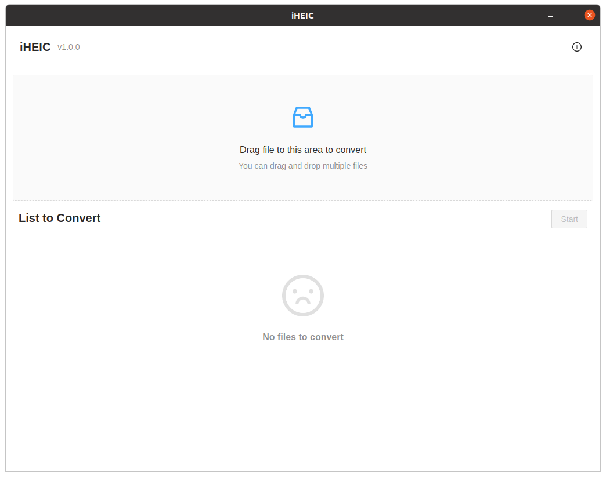
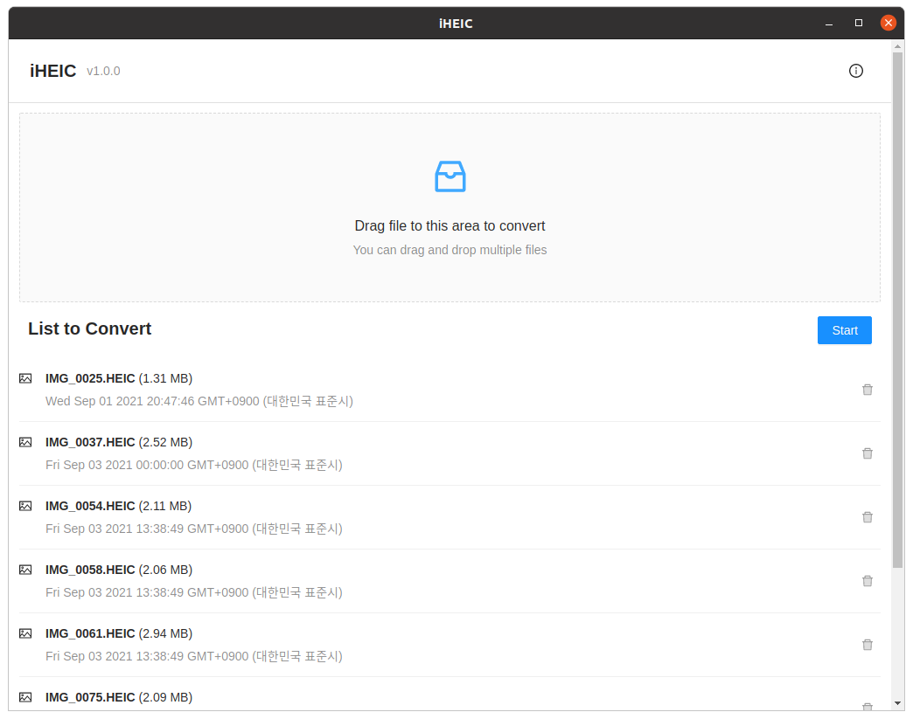
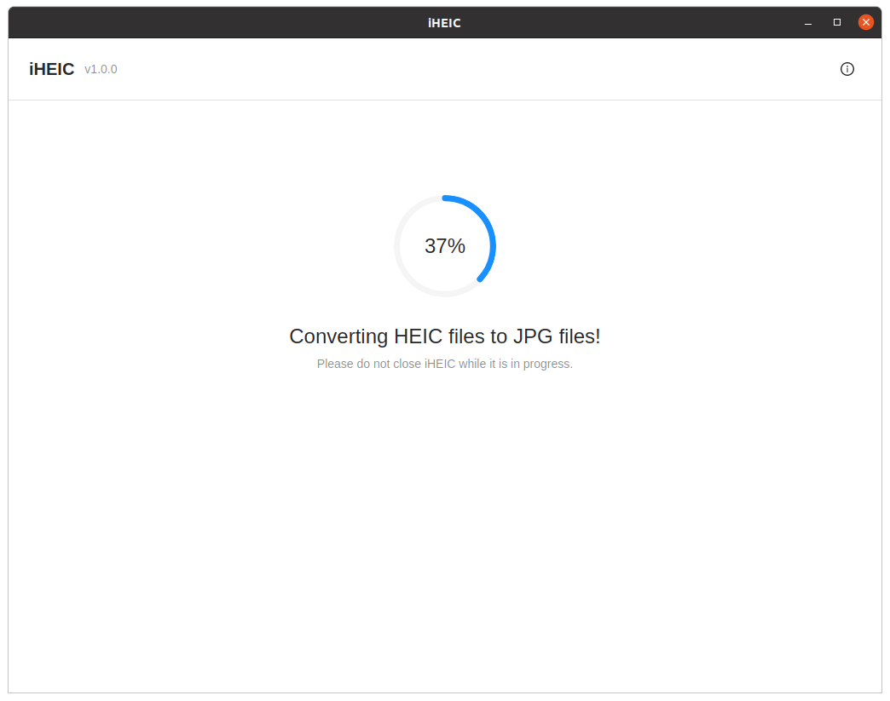
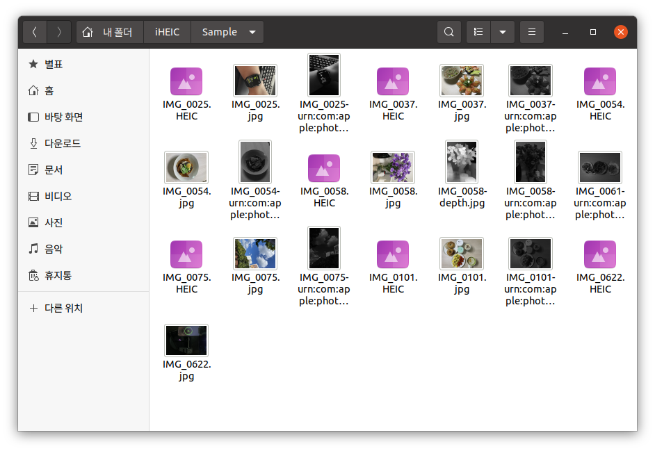

# iHEIC v1.0.0

iHEIC is convert HEIC to JPG📷 Simple and Easy🤓  

## How to use

1. Install and launch iHEIC.  
   

2. Drag and drop the HEIC file into the gray box at the top.  
   Click the 'Start' button to start the conversion.  
   

3. Conversion starts, wait for it to complete.  
   Please do not close iHEIC while it is in progress.  
   

4. When the conversion is complete, go to the HEIC folder.  
   You can see it has been converted to JPG.  
   

## Thanks to

- [libheif @strukturag](https://github.com/strukturag/libheif)
